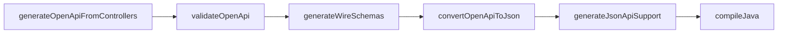

# OpsonAPI Gradle Plugin

Gradle plugin (`com.opsonapi`) that generates JSON:API wire schemas and support code from OpenAPI 3.1 specs and entity YAML files.

## Installation

**mavenLocal (development):**

```bash
./gradlew -PpublishOnly=true publishLibrariesToMavenLocal
```

```kotlin
// settings.gradle.kts
pluginManagement {
    repositories {
        mavenLocal()
        gradlePluginPortal()
    }
    plugins {
        id("com.opsonapi") version "0.1.0-SNAPSHOT"
    }
}

// build.gradle.kts
plugins {
    id("com.opsonapi")
}
```

**Composite build (contributors):** include the plugin project in `pluginManagement { includeBuild("opsonapi-gradle-plugin") }` and apply `id("com.opsonapi")` without a version.

**Maven Central:** not published yet; coordinates will be `com.opsonapi:com.opsonapi.gradle.plugin`.

## DSL reference

```kotlin
opsonapi {
    specFile.set(file("src/main/resources/openapi/openapi.yaml"))
    generatedPackage.set("com.example.generated")
    failOnWarnings.set(true)
    controllerSourceDirs.set(listOf("src/main/java"))
    controllerPathsOutput.set(file("build/generated/openapi/controller-paths.yaml"))
}
```

| Property | Default |
|----------|---------|
| `specFile` | `src/main/resources/openapi/openapi.yaml` |
| `generatedPackage` | `com.opsonapi.generated` |
| `failOnWarnings` | `true` |
| `controllerSourceDirs` | `[src/main/java]` |
| `controllerPathsOutput` | `build/generated/openapi/controller-paths.yaml` |

## Task graph



| Task | Output |
|------|--------|
| `validateOpenApi` | Fails build on parse/validation errors |
| `generateWireSchemas` | `build/generated/resources/openapi/schemas/*.yaml` with `$defs/opsonapi-*` |
| `convertOpenApiToJson` | `build/generated/resources/openapi/openapi/openapi.json` |
| `generateOpenApiFromControllers` | `build/generated/openapi/controller-paths.yaml` |
| `generateJsonApiSupport` | `build/generated/sources/opsonapi/{package}/` context classes + registry |

Generated source and resource directories are registered on the `main` source set automatically.

## Entity schemas

See [docs/entity-schemas.md](../docs/entity-schemas.md) for YAML conventions, operation keys, and the `x-member-entity-schema` extension.

## OpenAPI path extensions

REST operations use `x-entity-schema` + `x-operation` on each path method. Service dispatch (`x-service`) lives on entity schema `dependentSchemas.$` branches.

Atomic paths use `x-atomic-allowed-operations` and `x-atomic-operation-services` on the path operation.
